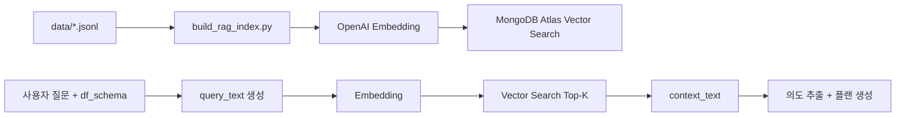

# Query Visualization

**개요**

이 모듈은 자연어 질문과 SQL 결과(ROW 리스트)를 입력받아 분석 의도를 추정하고, 규칙 기반 플랜과 RAG 컨텍스트를 활용해 차트 추천과 결과 시각화를 반환합니다. API, 플랜 엔진, RAG 인덱싱/검색, 스키마 요약 유틸이 포함됩니다.

**Docker 실행**

1. `query-visualization/.env` 파일을 준비합니다. (`OPENAI_API_KEY`, Oracle/Mongo 관련 변수)
2. 아래 명령으로 API + UI를 함께 실행합니다.

```bash
docker compose -f query-visualization/deploy/compose/docker-compose.yml up -d --build
```

서비스 주소

- API: `http://localhost:8080`
- UI: `http://localhost:3001`

참고

- 기본값은 Oracle thin 모드입니다.
- Oracle thick 모드가 필요하면 `query-visualization/oracle/instantclient_23_26` 경로에 클라이언트를 두고 `ORACLE_DRIVER_MODE=thick`를 설정합니다.
- 포트 충돌 시 `VIS_API_HOST_PORT`, `VIS_UI_HOST_PORT` 환경변수로 호스트 포트를 변경할 수 있습니다.

**입출력**

`POST /visualize` 입력

| 필드 | 타입 | 설명 |
| --- | --- | --- |
| user_query | string | 사용자 자연어 질문 |
| sql | string | text-to-sql 모듈이 만든 SQL |
| rows | array<object> | SQL 실행 결과(ROW 리스트) |

`POST /visualize` 출력 (`VisualizationResponse`)

| 필드 | 타입 | 설명 |
| --- | --- | --- |
| sql | string | 원본 SQL |
| table_preview | array<object> | 결과 미리보기(상위 20행) |
| analyses | array<object> | 차트 추천 목록 |
| insight | string | 통합 분석 요약(가능한 경우 LLM 생성) |
| fallback_used | boolean | fallback 경로 사용 여부 |
| fallback_stage | string | fallback 단계(`retry_relaxed` 등) |
| failure_reasons | array<string> | 시각화 실패/차단 사유 목록 |
| attempt_count | number | 시도 횟수 (1: normal, 2: relaxed 재시도) |

`analyses` 항목 구조 (`AnalysisCard`)

| 필드 | 타입 | 설명 |
| --- | --- | --- |
| chart_spec | object | 차트 스펙 (`chart_type`, `x`, `y`, `group`, `agg`) |
| reason | string | 추천 이유 |
| figure_json | object | Plotly figure JSON |
| code | string | 차트 생성 코드(디버깅용) |
| summary | string | 자연어 요약(선택) |

예시 입력 (실제 예시 기반)

```json
{
  "user_query": "ICU 첫 병동별 평균 LOS를 보여줘",
  "sql": "SELECT FIRST_CAREUNIT, AVG(LOS) AS avg_los FROM ICUSTAYS WHERE FIRST_CAREUNIT IS NOT NULL AND LOS IS NOT NULL GROUP BY FIRST_CAREUNIT",
  "rows": [{"FIRST_CAREUNIT": "MICU", "AVG_LOS": 3.2}]
}
```\n
**처리 흐름**

1. 입력 `rows`를 `DataFrame`으로 변환
2. 필요한 경우 경과시간 파생 컬럼 추가 (`elapsed_icu_days`, `elapsed_admit_days`)
3. 스키마 요약(`df_schema`) 생성
4. RAG 컨텍스트 검색(질문 + 스키마 기반)
5. 의도 추출(LLM 우선, 실패 시 규칙 기반 fallback)
6. 플랜 생성(룰 엔진 + RAG 예시)
7. 차트 코드 생성/실행 및 결과 묶기

**플랜 규칙 상세**

| 규칙 | 조건 | 영향 |
| --- | --- | --- |
| RAG chart_spec 우선 | 컨텍스트에 `chart_spec` 존재 | 컬럼 존재 시 해당 스펙을 우선 제안 |
| 별칭 기반 추론 | `x_time`/`y_value`, `x_group`/`y_value` 존재 | line/bar 기본 플랜 생성 |
| ICU trend 제한 | `icu_context`이면서 `stay_id`/`intime`/`charttime` 미존재 | trend 플랜 생성 금지 |
| 경과시간 강제 | ICU/입원 문맥 trend | `elapsed_*` 컬럼 없으면 생성 요구 |
| 식별자 그룹 금지 | comparison/distribution | `subject_id`/`hadm_id`/`stay_id` 그룹 금지 |
| correlation 제한 | correlation 의도 | 식별자 변수 사용 금지 |
| rate/amount trend 제한 | trend + rate/amount | 시간 binning 없으면 trend 금지 |\n**플랜 규칙 요약**

- RAG 컨텍스트에 `chart_spec`이 포함되면 우선 제안하며, 실제 컬럼 존재 여부를 확인합니다.
- 결과 컬럼만으로도 차트 추론 가능 시(별칭 기반, 시간+숫자, 숫자 2개, 범주+숫자 등) 기본 플랜을 생성합니다.
- `trend` 의도는 시간축과 trajectory 단위 그룹을 강제합니다.
- ICU/입실 문맥은 보수적으로 판단하며, `stay_id`/`intime` 또는 키워드로 문맥 플래그를 설정합니다.
- `comparison`/`distribution`은 식별자(`subject_id`, `hadm_id`, `stay_id`) 그룹을 금지합니다.
- `correlation`은 식별자 변수와의 상관 분석을 금지합니다.
- `rate`/`amount` 계열은 시간 binning 없이 trend 생성 불가입니다.

Intent별 기본 추천

- `trend`: `line`(trajectory), `box`(시간 구간 분포), 필요 시 그룹별 `box`
- `distribution`: `hist`, 필요 시 그룹별 `box`
- `comparison`: 그룹별 `box`
- `correlation`: `scatter`

**RAG 구조**

- 데이터 소스: `data/*.jsonl`
- 인덱싱: `scripts/build_rag_index.py`
- 임베딩: OpenAI 임베딩 모델(`OPENAI_EMBEDDING_MODEL`, 기본 `text-embedding-3-small`)
- 벡터 스토어: MongoDB Atlas Vector Search (`vector_store.py`)
- 검색: 질문 + 스키마 요약을 텍스트로 구성 → 임베딩 → Top-K 검색 → 컨텍스트 합성

RAG에 사용되는 주요 문서 유형

- 스키마/시맨틱 카탈로그: `schema_catalog.json`, `schema_catalog.jsonl`
- 질의 예시: `sql_examples.jsonl`
- 템플릿: `sql_templates.jsonl`, `join_templates.jsonl`
- 용어집: `glossary_docs.jsonl`
- 예시 컨텍스트: `rag_seed.jsonl`, `rag_examples.jsonl`

**파일 설명**

| 경로 | 설명 |
| --- | --- |
| `src/api/server.py` | FastAPI 엔드포인트(`/visualize`, `/health`, `/db-test`) |
| `src/agent/analysis_agent.py` | 전체 파이프라인 오케스트레이션 |
| `src/agent/intent_extractor.py` | 의도/축/그룹 추출(LLM + 규칙 fallback) |
| `src/agent/chart_rule_engine.py` | 플랜 룰 엔진 및 검증 로직 |
| `src/agent/retrieval.py` | RAG 검색(임베딩 + Top-K) |
| `src/db/vector_store.py` | MongoDB Atlas Vector Search 연동 |
| `src/db/schema_introspect.py` | 스키마 요약 유틸 |
| `src/models/chart_spec.py` | 응답 모델 정의(ChartSpec/AnalysisCard) |
| `scripts/build_rag_index.py` | RAG 인덱스 구축 스크립트 |
| `data/` | RAG 시드/템플릿/예시 데이터 |
| `ui/` | 프론트엔드 리소스(패키지/서버 스크립트 포함) |
| `requirements.txt` | Python 의존성 |
| `.env` | API 키 및 RAG 설정 |\n**RAG 인덱싱/검색 흐름 (Mermaid)**


